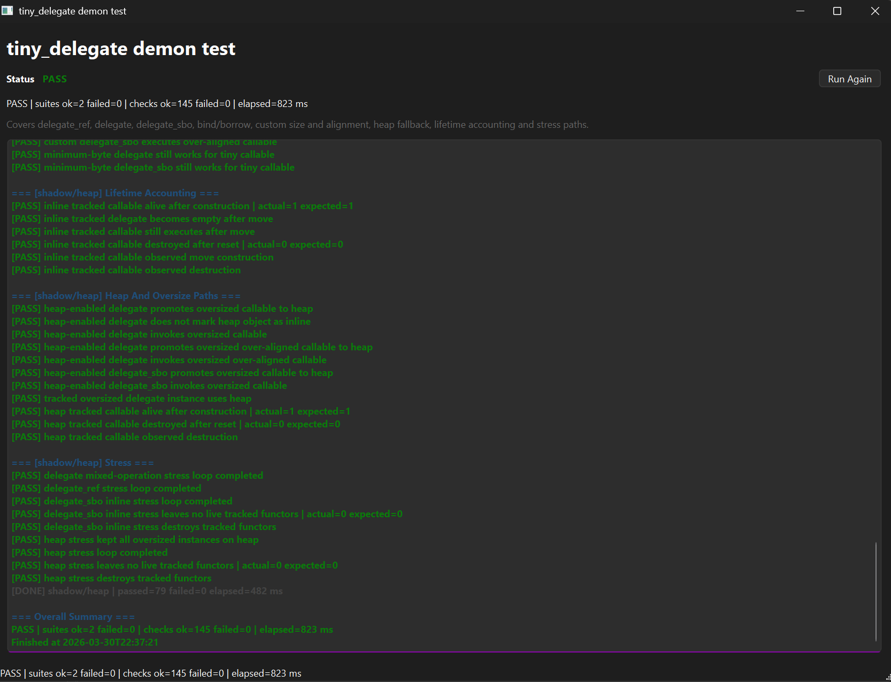

# tiny_delegate

[](https://github.com/shpegun60/delegate/actions/workflows/ci.yml)
[](LICENSE)

`tiny_delegate.hpp` is a compact C++17/C++20 callback library with three related delegate types:

- `tiny::delegate_ref<Sig>`: non-owning, cheap to copy and rebind
- `tiny::delegate_sbo<Sig, InlineBytes, InlineAlign>`: owning, move-only, SBO-first
- `tiny::delegate<Sig, InlineBytes, InlineAlign>`: hybrid, move-only, owns by default but can switch into explicit ref mode

It is aimed at projects that want a small, explicit, predictable callback abstraction without immediately defaulting to `std::function`.

## Screenshot



## Features

- C++17/C++20 compatible
- No exceptions required by design; delegate moves and destruction are
  unconditionally `noexcept`. Inline-stored callables must be
  nothrow-move-constructible (enforced at compile time with a message that
  names the fix); with the heap fallback enabled, a callable whose move may
  throw is stored on the heap instead — its handoff move needs no payload
  move at all. Everything stored must be nothrow-destructible.
- Fail-closed runtime guards: calling an empty delegate or assigning a null
  function pointer traps deterministically by default; the policy is fully
  overridable through `TINY_DELEGATE_ASSERT`
- Move-only owning delegates
- Non-owning ref delegate
- Small-buffer optimization with a platform-scaled default capacity
  (four machine words: 16 bytes on a 32-bit MCU, 32 on a 64-bit host)
- Optional heap fallback
- Explicit `borrow` and `bind` APIs
- Compile-time fit checks for size and alignment; non-callable arguments are
  rejected at overload resolution (SFINAE-constrained constructors)
- Works with move-only callables

## Why tiny_delegate?

`tiny_delegate` is strong not because it tries to beat every callback library on every axis, but because it hits a very practical balance:

- explicit lifetime semantics
- predictable ownership
- low-level control over size and alignment
- simple API surface
- good fit for embedded and systems code

### What is especially good about it

- It gives you three clear tools instead of one overloaded abstraction:
  - `delegate_ref` for non-owning callback views
  - `delegate_sbo` for owning-only callbacks
  - `delegate` for hybrid "automatic chooser" behavior
- `tiny::delegate` is unusually practical because it can switch between:
  - function pointer path
  - owning functor/lambda path
  - explicit `borrow(...)` ref path
  - explicit `bind<&T::method>(obj)` ref path
- `borrow` and `bind` are explicit, which makes lifetime intent visible in code instead of hidden in implicit conversions.
- Size and alignment are first-class configuration knobs:
  - `InlineBytes`
  - `InlineAlign`
  - `fits_inline`
  - `required_inline_bytes`
  - `required_inline_align`
  - `static_assert_fits_inline`
- Heap fallback can be disabled completely, which is a very strong property for embedded code.
- Oversized or over-aligned owning callables can fail at compile time instead of surprising you at runtime.
- Introspection is built in:
  - `owning()`
  - `non_owning()`
  - `uses_inline()`
  - `uses_heap()`

### Why that matters in practice

For ordinary application code, many callback wrappers are "good enough".

For low-level code, firmware, hot paths, or callback-heavy infrastructure, the usual questions are:

- who owns the callable?
- is this a borrowed reference or an owned object?
- can this allocate?
- will this fit inline?
- what happens if alignment is larger than expected?

`tiny_delegate` answers those questions directly in the API.

### Compared with common alternatives

#### Compared with `llvm::function_ref`

`llvm::function_ref` is a non-owning callable reference and is mainly intended for short-lived parameter use.

`tiny_delegate` gives you that style through `delegate_ref`, but also adds:

- owning delegates
- SBO
- optional heap fallback
- explicit member binding
- one hybrid type that can do both owning and ref modes

If you only want a tiny non-owning parameter wrapper, `llvm::function_ref` is simpler.
If you want one small library that covers both stored and non-stored callbacks, `tiny_delegate` is broader.

#### Compared with `absl::AnyInvocable`

`absl::AnyInvocable` is a move-only owning callable wrapper.

`tiny_delegate` is stronger when you want:

- an explicit non-owning companion type
- explicit `borrow(...)`
- explicit method binding
- size and alignment surfaced as part of the public API
- embedded-friendly "no heap fallback" configuration

If you only need a production-grade move-only owning wrapper inside the Abseil ecosystem, `AnyInvocable` is a strong choice.
If you want a unified owning + non-owning delegate toolbox, `tiny_delegate` gives you more structure.

#### Compared with `function2`

`function2` is a very feature-rich library. It supports copyable wrappers, move-only wrappers, non-owning views, richer qualifier handling and multi-signature overload support.

`tiny_delegate` is attractive when you want something smaller and easier to reason about:

- simpler mental model
- explicit ownership split
- direct embedded-oriented size/alignment controls
- direct `borrow` / `bind` APIs

If you need maximum wrapper expressiveness, `function2` may be stronger.
If you want a smaller, more focused delegate library with very explicit semantics, `tiny_delegate` is often the nicer fit.

#### Compared with ETL-style embedded delegates

ETL-style delegates are often very good for embedded work, especially when you want non-owning callback references.

Measured head-to-head against `etl::delegate` (ETL 20.x, same harness as
the std::function numbers):

| | `etl::delegate` | `tiny::delegate_ref` |
| --- | --- | --- |
| size (ARM32 / x64) | 8 / 16 B | 8 / 16 B |
| call speed (x64) | 0.94 ns | 0.94 ns |
| call path (Cortex-M4) | 3 instructions, **no empty check** | 5 instructions incl. guard |
| calling an empty delegate | **segfault / HardFault** (measured SIGSEGV with the default config) | deterministic trap |
| temporaries | rejected | rejected |

So in the non-owning niche the two are equals, with one philosophical
difference: `etl::delegate` spends zero instructions on the empty check
and crashes uncontrolled when misused; `tiny::delegate_ref` spends two
and traps deterministically — and `#define TINY_DELEGATE_ASSERT(e, m)
((void)0)` buys the ETL behavior back if those two instructions matter.

What `etl::delegate` does not have at all is the owning tier:
`tiny_delegate` adds

- a dedicated owning type with SBO (`delegate_sbo`) — capturing lambdas
  and move-only functors stored inside the delegate, temporaries welcome
- a hybrid type that can choose automatically
- compile-time size/alignment fit tooling for owned callables

That makes it attractive when your project mixes classic embedded callback references with modern lambdas and move-only functors.

### Works with tickcore out of the box

[tickcore](https://github.com/shpegun60/tickcore)'s `Scheduler` accepts any
named callable, so every delegate type drops straight into a timer task with
no integration code:

```cpp
#include "Timers.h"          // tickcore
#include "tiny_delegate.hpp"

unsigned attempts = 0u;
auto retry = tiny::delegate<bool()>{[&attempts] { return ++attempts < 3u; }};

(void)scheduler.every(100u, retry);   // repeats while the delegate returns true
```

The usual lifetime rule applies twice: the delegate must outlive the task,
and whatever a `borrow`/`bind` delegate references must outlive the delegate.

### Honest limitations

`tiny_delegate` is not trying to be the best at everything.

Other libraries may be better if you need:

- copyable owning delegates as the main API
- allocator-aware wrappers
- multiple overload signatures in one wrapper type
- full cv/ref/noexcept-qualified wrapper signatures
- a very large existing ecosystem around the callback type

Its strength is not "maximum feature count".
Its strength is clarity, predictability, and a very good ownership model for real systems code.

## Performance vs std::function

Measured, not estimated (GCC -O2; call numbers are the best of 5 runs of
100M calls; assignment is 10M iterations; ARM numbers from
arm-none-eabi-g++ -Os for Cortex-M4):

### Object sizes (RAM per stored callback)

| Type | ARM32 (Cortex-M) | x64 host |
| --- | --- | --- |
| raw function pointer + `void*` context | 8 B | 16 B |
| `tiny::delegate_ref` | **8 B** | **16 B** |
| `tiny::delegate_sbo<Sig, 16, 4>` | 28 B | — |
| `tiny::delegate` (platform default SBO) | 32 B | 64 B |
| `std::function` | 16 B | 32 B |

`std::function` looks smaller than the owning delegates until a real
capture arrives: its internal buffer holds only ~8–16 B (libstdc++) and
anything else becomes the 16/32 B object **plus a heap block plus
allocator overhead** — while the delegate stays flat, with the capacity
you chose. `delegate_ref` matches a raw pointer pair exactly.

### Call and assignment speed (x64, GCC -O2)

| Operation | direct lambda | tiny_delegate | std::function |
| --- | --- | --- | --- |
| call | 0.25 ns | 0.93 ns (`ref` and owning alike) | 0.94 ns |
| assign small lambda (16 B capture) | — | **0.94 ns** | 3.0 ns |
| assign big lambda (48 B capture) | — | **0.96 ns, inline** | 21.4 ns, **heap allocation each time** |

Assignment is the axis that matters: constant-time and heap-free for the
delegate at any capture size, versus an `operator new` per assignment
once `std::function`'s tiny buffer overflows.

### Code size and dependencies (Cortex-M4, -Os, store + call one lambda)

| | tiny_delegate | std::function |
| --- | --- | --- |
| call path | **6 instructions, no stack frame, tail `bx`** | 13+ instructions, stack frame, argument spilled and passed by pointer |
| flash per use site | 112 B (`delegate_ref`) / 218 B (owning) | 306 B |
| link-time dependencies | none | `__throw_bad_function_call`, unwinder + exception tables |

The call path is two loads, a predictable null check, and a tail jump —
the invoker receives the payload pointer directly, exactly one
indirection, and the empty-check branch is laid out cold via
`TINY_DELEGATE_UNLIKELY`. Assignment never touches the heap unless the
application explicitly enabled the fallback, so its cost is constant and
deterministic — the property that matters on an MCU.

## Where does a callable live?

Every cell below was measured with intercepted `operator new`, not quoted
from documentation (x64; buffer sizes: libstdc++ 16 B, MSVC ~48 B,
tiny_delegate default 32 B on x64 / 16 B on a 32-bit MCU, configurable):

| Capture | libstdc++ (GCC) | MSVC STL | tiny (default, no heap) | tiny (fallback = 1) |
| --- | --- | --- | --- | --- |
| POD, 8 B | inline | inline | inline, 0 allocs | inline, 0 allocs |
| POD, 16 B | inline | inline | inline, 0 allocs | inline, 0 allocs |
| POD, 24 B | 🔴 silent heap | inline | inline, 0 allocs | inline, 0 allocs |
| POD, 100 B (over buffer) | 🔴 silent heap | 🔴 silent heap | 🟡 compile error, needed/available sizes in the message | heap, visible via `uses_heap()` |
| non-trivial 8 B, move **not** noexcept | 🔴 silent heap | 🔴 silent heap | 🟡 compile error naming both fixes (add `noexcept`, or enable the fallback) | heap, visible via `uses_heap()` |
| non-trivial 8 B, move noexcept | 🔴 silent heap\* | inline | inline, 0 allocs | inline, 0 allocs |

\* libstdc++ additionally requires the callable to be trivially copyable
("location invariant"), so even the `noexcept` variant goes to the heap.

Three properties fall out of the table:

- **No silent-heap cells.** tiny_delegate's columns contain only green
  (inline, zero allocations) and explicit outcomes: a loud compile error
  with the fix named, or a heap placement that `uses_heap()` reports.
- **No compiler lottery.** The std columns disagree with each other
  (compare the POD-24 and noexcept rows on GCC vs MSVC); the tiny columns
  behave identically on GCC, Clang, MSVC, and arm-none-eabi, because the
  placement rule is a single public formula: fits by size and alignment
  (`fits_inline<T>()`) **and** is nothrow-move-constructible → inline;
  otherwise heap (if enabled) or a compile error.
- **The fallback build accepts everything std::function accepts** — the
  strict no-heap guarantee is a choice, not a limitation.

## Consuming the library

The library is a single header: nothing is compiled or linked, a consumer
only needs the repository root on its include path and C++17.

- **Plain include path** (STM32CubeIDE, Keil, any build system): add the
  repository directory to the compiler include paths.
- **CMake** (vendored copy, git submodule, or FetchContent): the root
  provides the `tiny_delegate::tiny_delegate` INTERFACE target:

  ```cmake
  add_subdirectory(third_party/delegate)
  target_link_libraries(app PRIVATE tiny_delegate::tiny_delegate)
  ```

  The test suite builds only when the project is configured directly
  (`cmake -S . -B build && ctest --test-dir build`), never for consumers.

## Header

```cpp
#include "tiny_delegate.hpp"
```

## The Three Main Types

### `tiny::delegate_ref<Sig>`

Non-owning callback view.

- Stores a free-function pointer, or
- stores a pointer to an external callable/object

Properties:

- copyable
- does not manage lifetime
- very cheap to copy and reassign

Use it when:

- the target object definitely outlives the callback
- you want maximum cheapness
- you do not want ownership at all

### `tiny::delegate_sbo<Sig, InlineBytes, InlineAlign>`

Owning callback.

Properties:

- move-only
- owns the callable
- stores inline when it fits
- can optionally fall back to heap if enabled
- has no borrow/ref mode

Use it when:

- you want ownership only
- you want the type itself to communicate "this callback owns its target"
- you want SBO behavior without the hybrid ref path

### `tiny::delegate<Sig, InlineBytes, InlineAlign>`

Hybrid callback.

Properties:

- move-only
- function pointer path for free functions and captureless non-generic lambdas
- owning path for normal lambdas/functors
- explicit ref path via `tiny::borrow(x)`
- explicit ref path via `tiny::bind<&T::method>(obj)`

Use it when:

- you want one type for most callback use cases
- sometimes you want ownership, sometimes borrow/bind

## Which Type Should I Use?

| Need | Recommended type |
|---|---|
| Pure non-owning callback view | `tiny::delegate_ref<Sig>` |
| Always own the callable | `tiny::delegate_sbo<Sig, ...>` |
| One general-purpose callback type | `tiny::delegate<Sig, ...>` |
| Embedded code with strict lifetime discipline | `tiny::delegate_ref<Sig>` or `tiny::delegate<Sig, ...>` with heap fallback off |

## Capability Matrix

| Source / behavior | `delegate_ref` | `delegate_sbo` | `delegate` |
|---|---|---|---|
| Free function pointer | yes | yes | yes |
| Captureless non-generic lambda | yes, through function-pointer conversion | yes | yes |
| Stateful lambda | yes, only via `tiny::borrow(lvalue)` | yes, as owned callable | yes, as owned callable |
| Move-only lambda | no | yes | yes |
| Functor object | yes, only via `tiny::borrow(lvalue)` | yes | yes |
| Direct `tiny::borrow(...)` API | yes | no | yes |
| Direct method-bind API | yes | no | yes |
| Copyable type | yes | no | no |
| Can use heap fallback | no | yes | yes |
| Can be in explicit ref mode | yes | no | yes |

## What Each Type Can Be Constructed From

### `delegate_ref`

Accepted forms:

- free-function pointer
- captureless non-generic lambda, via conversion to function pointer
- `tiny::borrow(functor_lvalue)`
- `tiny::borrow(generic_lambda_lvalue)`
- `tiny::delegate_ref<Sig>::bind<&T::method>(obj)`

Examples:

```cpp
int plus_one(int x) { return x + 1; }

struct Functor {
    int operator()(int x) { return x + 10; }
};

struct Device {
    int read(int x) { return x + 100; }
};

Functor fn;
Device dev;

tiny::delegate_ref<int(int)> a = &plus_one;
tiny::delegate_ref<int(int)> b = tiny::borrow(fn);
tiny::delegate_ref<int(int)> c =
    tiny::delegate_ref<int(int)>::bind<&Device::read>(dev);
```

Not supported:

- owning a temporary lambda/functor
- move-only callable ownership
- heap fallback

### `delegate_sbo`

Accepted forms:

- free-function pointer
- captureless non-generic lambda
- generic lambda, as owned callable
- stateful lambda
- move-only lambda
- functor object

Examples:

```cpp
tiny::delegate_sbo<int(int), 64> a = &plus_one;
tiny::delegate_sbo<int(int), 64> b = [](int x) { return x + 2; };
tiny::delegate_sbo<int(int), 64> c = [sum = 0](int x) mutable { return sum += x; };
tiny::delegate_sbo<int(int), 64> d = Functor{};
```

Not supported:

- `tiny::borrow(...)`
- `tiny::bind<&T::method>(obj)`
- ref mode of any kind

If you really need to call an external object through `delegate_sbo`, you can still wrap it manually:

```cpp
struct Device {
    int read(int x) { return x + 1; }
};

Device dev;

tiny::delegate_sbo<int(int), 64> cb = [&dev](int x) {
    return dev.read(x);
};
```

But note what this means:

- `delegate_sbo` owns the lambda wrapper
- it does not own `dev`
- `dev` must still outlive callback use
- this is not the same as library-level `borrow` / `bind`

### `delegate`

Accepted forms:

- free-function pointer
- captureless non-generic lambda
- generic lambda, as owned callable
- stateful lambda
- move-only lambda
- functor object
- `tiny::borrow(functor_lvalue)`
- `tiny::bind<&T::method>(obj)`

Examples:

```cpp
tiny::delegate<int(int)> a = &plus_one;
tiny::delegate<int(int)> b = [](int x) { return x + 2; };
tiny::delegate<int(int)> c = [sum = 0](int x) mutable { return sum += x; };
tiny::delegate<int(int)> d = Functor{};
tiny::delegate<int(int)> e = tiny::borrow(fn);
tiny::delegate<int(int)> f = tiny::bind<&Device::read>(dev);
```

This is the "automatic chooser" type:

- if the input behaves like a function pointer, it uses the function-pointer path
- if the input is a normal callable object, it owns it
- if the input is `borrow(...)`, it becomes non-owning
- if the input is `bind(...)`, it becomes non-owning method binding

## Configuration Macros

Define these before including the header.

```cpp
#define TINY_DELEGATE_DEFAULT_BYTES 64
#define TINY_DELEGATE_DEFAULT_ALIGN alignof(std::max_align_t)
#define TINY_DELEGATE_ENABLE_HEAP_FALLBACK 0
#define TINY_DELEGATE_ASSERT(expr, msg) ((void)0)
#include "tiny_delegate.hpp"
```

### `TINY_DELEGATE_DEFAULT_BYTES`

Default inline byte capacity used by:

- `tiny::delegate<Sig>`
- free `tiny::bind<&T::method>(obj)` helper

Default (platform-scaled — four machine words, never below the layout
minimum of 16):

```cpp
((4u * sizeof(void*)) < 16u ? 16u : (4u * sizeof(void*)))
// 16 bytes on a 32-bit MCU, 32 bytes on a 64-bit host
```

Use `delegate64<Sig>` / `delegate<Sig, N>` when a bigger inline buffer is
intended.

**The capacity is part of the type — configure it consistently.**
`tiny::delegate<void()>` compiled with `TINY_DELEGATE_DEFAULT_BYTES 64` and
the same spelling compiled with the default are two *different types* with
different mangled names. Mixing them across translation units fails loudly
at link time (`undefined reference`) — never silently — but the rules that
avoid the failure are simple:

1. **Never define the macro per-file.** Set it once for the whole project
   in the build system, so every TU agrees:
   `add_compile_definitions(TINY_DELEGATE_DEFAULT_BYTES=32)` (CMake) or
   `DEFINES += TINY_DELEGATE_DEFAULT_BYTES=32` (qmake).
2. **Across API boundaries, don't rely on the default at all.** Spell the
   size explicitly in public signatures, or define one project-wide alias
   and use it everywhere:

   ```cpp
   // app_delegate.h
   template <class Sig>
   using AppDelegate = tiny::delegate<Sig, 32, 8>;  // explicit, macro-proof
   ```
3. To check whether a callable fits before committing to a size, use the
   built-in tooling: `fits_inline<T>()`, `required_inline_bytes<T>()`, and
   `static_assert_fits_inline<T>()`. An oversized callable is a compile
   error with the needed/available sizes in the message.

### `TINY_DELEGATE_DEFAULT_ALIGN`

Default inline alignment used by `tiny::delegate<Sig>`.

Default:

```cpp
alignof(std::max_align_t)
```

### `TINY_DELEGATE_ENABLE_HEAP_FALLBACK`

Controls behavior when an owning callable does not fit inline.

- `0`: compile-time failure
- `1`: allocate on heap

Default:

```cpp
0
```

### `TINY_DELEGATE_ASSERT(expr, msg)`

User hook for runtime assertions. It guards every unsafe entry point:
calling an empty delegate and assigning a null function pointer.

Default (fail-closed): a violated guard traps deterministically —
`__builtin_trap()` on GCC/Clang (a single `udf` instruction on ARM),
`std::abort()` elsewhere — instead of continuing into undefined behavior
such as an indirect call through a null pointer.

```cpp
// effective default
#define TINY_DELEGATE_ASSERT(expr, msg) \
    do { if (!(expr)) { ::tiny::detail::trap(); } } while (false)
```

Override examples:

```cpp
// integrate a project assert
#include <cassert>
#define TINY_DELEGATE_ASSERT(expr, msg) assert((expr) && (msg))
#include "tiny_delegate.hpp"

// or restore the old fully unchecked behavior
#define TINY_DELEGATE_ASSERT(expr, msg) ((void)0)
#include "tiny_delegate.hpp"
```

## Quick Start

```cpp
#include "tiny_delegate.hpp"

int plus_one(int x) { return x + 1; }

struct Worker {
    int base = 10;
    int add(int x) { return base + x; }
};

int main() {
    tiny::delegate<int(int)> a = &plus_one;

    Worker w{20};
    tiny::delegate<int(int)> b = tiny::bind<&Worker::add>(w);

    auto counter = [sum = 0](int x) mutable {
        sum += x;
        return sum;
    };
    tiny::delegate<int(int)> c = counter;

    return a(1) + b(2) + c(3);
}
```

## About `auto`

Yes, you can use `auto` for local variables when the initializer already creates a delegate object.

Examples:

```cpp
auto counter = [sum = 0](int x) mutable { return sum += x; };
Worker w{20};

auto a = tiny::delegate<int(int)>{&plus_one};
auto b = tiny::delegate_sbo<int(int), 64>{[](int x) { return x + 2; }};
auto c = tiny::delegate_ref<int(int)>{tiny::borrow(counter)};
auto d = tiny::bind<&Worker::add>(w);
```

Important:

```cpp
auto cb = &plus_one;
```

This is only a raw function pointer:

```cpp
int (*)(int)
```

It is not a `tiny::delegate`.

So these are different:

```cpp
auto a = &plus_one;                         // raw function pointer
auto b = tiny::delegate<int(int)>{&plus_one}; // delegate object
```

Practical rule:

- for API surface, class members, typedefs and examples that teach the library, prefer the explicit delegate type
- for local variables, `auto` is fine if the initializer already makes the delegate type obvious

## Basic Semantics

### Empty delegates

```cpp
tiny::delegate<void()> cb;

if (!cb) {
    // empty
}

cb = nullptr;
```

The same idea works for:

- `tiny::delegate_ref<Sig>`
- `tiny::delegate_sbo<Sig, ...>`
- `tiny::delegate<Sig, ...>`

Calling an empty delegate is guarded by `TINY_DELEGATE_ASSERT`, which traps
deterministically by default (hard failure, no undefined behavior). Override
the macro to log, assert, or — explicitly — remove the check.

### Copy and move rules

- `tiny::delegate_ref<Sig>` is copyable
- `tiny::delegate_sbo<Sig, ...>` is move-only
- `tiny::delegate<Sig, ...>` is move-only

Owning delegates are move-only so they can hold move-only callables.

## Usage Examples

### 1. Free function

```cpp
int on_value(int x) { return x + 5; }

tiny::delegate<int(int)> cb = &on_value;
int y = cb(7); // 12
```

This uses the function-pointer path.

### 2. Captureless non-generic lambda

```cpp
tiny::delegate<int(int)> cb = [](int x) { return x * 2; };
int y = cb(9); // 18
```

Because the lambda is captureless and non-generic, it converts to a function pointer.

### 3. Stateful lambda with owned copy

```cpp
auto stateful = [sum = 0](int x) mutable {
    sum += x;
    return sum;
};

tiny::delegate<int(int)> cb = stateful;

int a = cb(1);      // 1
int b = cb(2);      // 3
int c = stateful(5); // 5, separate state
```

Important:

- `stateful` keeps its own state
- `cb` stores its own copied state

This is expected behavior.

### 4. Move-only lambda

```cpp
#include <memory>

tiny::delegate<int(int)> cb = [ptr = std::make_unique<int>(40)](int x) {
    return *ptr + x;
};

int y = cb(2); // 42
```

Also works with `delegate_sbo`:

```cpp
tiny::delegate_sbo<int(int), 64> cb = [ptr = std::make_unique<int>(7)](int x) {
    return *ptr + x;
};
```

### 5. Pure non-owning callable with `delegate_ref`

```cpp
struct Accumulator {
    int total = 0;

    int operator()(int x) {
        total += x;
        return total;
    }
};

Accumulator acc;
tiny::delegate_ref<int(int)> ref = tiny::borrow(acc);

int a = ref(3); // 3
int b = ref(4); // 7
```

`ref` does not own `acc`.

### 6. Non-owning callable with `delegate`

```cpp
Accumulator acc;
tiny::delegate<int(int)> cb = tiny::borrow(acc);

int a = cb(3); // 3
int b = cb(4); // 7

bool is_ref = cb.non_owning(); // true
bool own = cb.owning();        // false
bool inl = cb.uses_inline();   // false
bool heap = cb.uses_heap();    // false
```

This is the hybrid delegate in explicit ref mode.

### 7. Borrowing a const functor

```cpp
struct Adder {
    int bias = 10;
    int operator()(int x) const { return bias + x; }
};

const Adder add{};
tiny::delegate<int(int)> cb = tiny::borrow(add);

int y = cb(5); // 15
```

This works because the callable is invocable as `const`.

### 8. Binding a non-const member function

```cpp
struct Device {
    int base = 100;
    int read(int x) { return base + x; }
};

Device dev{100};
tiny::delegate<int(int)> cb = tiny::bind<&Device::read>(dev);

int y = cb(23); // 123
```

### 9. Binding a const member function

```cpp
struct Sensor {
    int base = 50;
    int sample(int x) const { return base + x; }
};

const Sensor s{50};
tiny::delegate<int(int)> cb = tiny::bind<&Sensor::sample>(s);

int y = cb(2); // 52
```

### 10. `delegate_ref::bind`

If you want a pure ref delegate for a method:

```cpp
struct Driver {
    void tick() {}
};

Driver d;
tiny::delegate_ref<void()> ref =
    tiny::delegate_ref<void()>::bind<&Driver::tick>(d);
```

### 11. Owning-only delegate with `delegate_sbo`

```cpp
using Task = tiny::delegate_sbo<void(), 32>;

Task t = [] {
    // owned callable
};
```

This type never enters borrow/bind ref mode.

### 12. Custom-sized owning delegate

```cpp
using SmallCb = tiny::delegate<int(int), 16>;

SmallCb cb = [](int x) { return x + 4; };
int y = cb(3); // 7
```

If the callable does not fit and heap fallback is off, compilation fails.

### 13. Over-aligned callable

Sometimes a callable fits by size but not by alignment.

```cpp
struct alignas(32) BigAlign {
    int operator()(int x) const { return x + 1; }
};
```

On many platforms the default inline alignment is `16`, so this does not fit inline by default.

Use a larger alignment if you want inline storage:

```cpp
using AlignedCb = tiny::delegate<int(int), 64, 32>;

AlignedCb cb = BigAlign{};
int y = cb(5); // 6
```

The same idea applies to `tiny::delegate_sbo`.

### 14. Compile-time fit checks

```cpp
struct MyFunctor {
    int operator()(int) const { return 0; }
};

using D = tiny::delegate<int(int), 64>;

static_assert(D::fits_inline<MyFunctor>());
static_assert(D::required_inline_bytes<MyFunctor>() == sizeof(MyFunctor));
static_assert(D::required_inline_align<MyFunctor>() == alignof(MyFunctor));
```

If you want a clearer compile-time failure:

```cpp
using D = tiny::delegate<int(int), 64, 16>;
D::static_assert_fits_inline<MyFunctor>();
```

Also available on `tiny::delegate_sbo`.

### 15. Oversized callable with heap fallback on

```cpp
#define TINY_DELEGATE_ENABLE_HEAP_FALLBACK 1
#include "tiny_delegate.hpp"

struct Large {
    char payload[256]{};
    int operator()(int x) const { return x + 1; }
};

tiny::delegate<int(int), 64> cb = Large{};

bool heap = cb.uses_heap();    // true
bool inl = cb.uses_inline();   // false
```

The same pattern works for `tiny::delegate_sbo`.

### 16. Oversized callable with heap fallback off

With the default policy:

```cpp
#define TINY_DELEGATE_ENABLE_HEAP_FALLBACK 0
#include "tiny_delegate.hpp"
```

an oversized or over-aligned owning callable becomes a compile-time error.

This is often exactly what embedded code wants.

### 17. Resetting with `nullptr`

```cpp
tiny::delegate<void()> cb = [] {};
cb = nullptr;

if (!cb) {
    // empty again
}
```

The same works for:

- `tiny::delegate_ref<Sig>`
- `tiny::delegate_sbo<Sig, ...>`

### 18. Rebinding

```cpp
int plus_one(int x) { return x + 1; }
int plus_two(int x) { return x + 2; }

tiny::delegate<int(int)> cb = &plus_one;
cb = &plus_two;
cb = nullptr;
cb = &plus_one;
```

Rebinding an owning delegate destroys the previous owned target and installs the new one.

### 19. `sig_of_t` for signature deduction

```cpp
int plus_one(int x) { return x + 1; }

struct Worker {
    int run(int x) const { return x; }
};

using Sig1 = tiny::sig_of_t<decltype(&plus_one)>;     // int(int)
using Sig2 = tiny::sig_of_t<decltype(&Worker::run)>;  // int(int)
```

The free `tiny::bind<&T::method>(obj)` helper uses this same idea internally.

### 20. Free `bind` vs typed `bind`

Free helper:

```cpp
auto cb = tiny::bind<&Device::read>(dev);
```

Return type:

```cpp
tiny::delegate<tiny::sig_of_t<decltype(&Device::read)>>
```

That means the free helper uses the global defaults:

- `TINY_DELEGATE_DEFAULT_BYTES`
- `TINY_DELEGATE_DEFAULT_ALIGN`

If you need custom inline capacity or alignment, use the typed form:

```cpp
using FastCb = tiny::delegate<int(int), 32, 32>;
FastCb cb = FastCb::bind<&Device::read>(dev);
```

### 21. Generic lambda

Generic lambdas are not function pointers, but they still work as callable objects if the requested signature is valid.

Owned case:

```cpp
auto generic = [](auto x) { return x + 1; };

tiny::delegate<int(int)> a = generic;
tiny::delegate_sbo<int(int), 64> b = generic;
```

Borrowed case:

```cpp
tiny::delegate_ref<int(int)> ref = tiny::borrow(generic);
tiny::delegate<int(int)> borrowed = tiny::borrow(generic);
```

The important distinction is:

- captureless non-generic lambda can use the function-pointer path
- generic lambda is treated like a normal functor object

## Example Cookbook

This section is intentionally repetitive. It is here so the README can be used as a quick reference when you are trying to remember "can I do X with this delegate type?".

### 22. Void callback

```cpp
tiny::delegate<void()> cb = [] {
    // do something
};

if (cb) {
    cb();
}
```

### 23. Callback with multiple arguments

```cpp
tiny::delegate<int(int, int)> add = [](int a, int b) {
    return a + b;
};

int sum = add(2, 3); // 5
```

### 24. Store a delegate as a class member

```cpp
class JobQueue {
public:
    using DoneCb = tiny::delegate<void(int), 32>;

    void setDoneCallback(DoneCb cb) {
        done_ = std::move(cb);
    }

    void finish(int code) {
        if (done_) done_(code);
    }

private:
    DoneCb done_;
};
```

### 25. Pass a delegate into a function

```cpp
using Callback = tiny::delegate<void(int), 32>;

void subscribe(Callback cb) {
    if (cb) cb(42);
}

subscribe([](int value) {
    // value == 42
});
```

### 26. Return a delegate from a factory

```cpp
tiny::delegate<int(int)> make_scaler(int base) {
    return [base](int x) {
        return base * x;
    };
}

auto cb = make_scaler(3);
int y = cb(4); // 12
```

### 27. Return a bound method

```cpp
struct Device {
    int base = 7;
    int read(int x) const { return base + x; }
};

tiny::delegate<int(int)> make_reader(const Device& dev) {
    return tiny::bind<&Device::read>(dev);
}
```

The object must still outlive the returned delegate.

### 28. `delegate_ref` copied to multiple views

```cpp
struct Counter {
    int total = 0;

    int operator()(int x) {
        total += x;
        return total;
    }
};

Counter counter;

tiny::delegate_ref<int(int)> a = tiny::borrow(counter);
tiny::delegate_ref<int(int)> b = a;

int x = a(2); // 2
int y = b(3); // 5
```

Both refs target the same external object.

### 29. Switch one `delegate` between owning and ref modes

```cpp
struct Device {
    int base = 100;
    int operator()(int x) { return base + x; }
    int read(int x) { return base + x; }
};

Device dev;
tiny::delegate<int(int)> cb = [](int x) { return x + 1; }; // owning

cb = tiny::borrow(dev); // ref mode through operator()
cb = tiny::bind<&Device::read>(dev); // ref mode by method binding
cb = [value = 5](int x) { return value + x; }; // back to owning
```

`tiny::delegate` is the only one of the three types that can switch like this.

### 30. Capture by reference

```cpp
int external = 10;

tiny::delegate<int()> cb = [&external] {
    return external;
};

external = 20;
int y = cb(); // 20
```

The delegate owns the lambda object, but the lambda object still refers to `external`.

### 31. Mutable lambda with internal state

```cpp
tiny::delegate<int(int)> cb = [count = 0](int x) mutable {
    count += x;
    return count;
};

int a = cb(1); // 1
int b = cb(1); // 2
int c = cb(5); // 7
```

### 32. Method callback for a scheduler

```cpp
struct Task {
    void run() {
        // do work
    }
};

class Scheduler {
public:
    using Callback = tiny::delegate<void(), 32>;

    void set(Callback cb) {
        cb_ = std::move(cb);
    }

    void tick() {
        if (cb_) cb_();
    }

private:
    Callback cb_;
};

Task task;
Scheduler sch;
sch.set(tiny::bind<&Task::run>(task));
```

### 33. Ref-only callback for a scheduler

```cpp
struct Task {
    void run() {}
};

class Scheduler {
public:
    using Callback = tiny::delegate_ref<void()>;

    void set(Callback cb) { cb_ = cb; }
    void tick() { if (cb_) cb_(); }

private:
    Callback cb_;
};

Task task;
Scheduler sch;
sch.set(tiny::delegate_ref<void()>::bind<&Task::run>(task));
```

### 34. Use `delegate_sbo` when ownership must be explicit

```cpp
class WorkerPool {
public:
    using Job = tiny::delegate_sbo<void(), 48>;

    void setJob(Job job) {
        job_ = std::move(job);
    }

    void execute() {
        if (job_) job_();
    }

private:
    Job job_;
};
```

### 35. Check whether heap fallback was used

```cpp
#define TINY_DELEGATE_ENABLE_HEAP_FALLBACK 1
#include "tiny_delegate.hpp"

struct Large {
    char payload[256]{};
    void operator()() const {}
};

tiny::delegate<void(), 64> cb = Large{};

if (cb.uses_heap()) {
    // oversized callable went to heap
}
```

Only meaningful when heap fallback is enabled.

### 36. Check whether `delegate_sbo` stayed inline

```cpp
tiny::delegate_sbo<void(), 64> cb = [] {
    // small callable
};

bool inl = cb.uses_inline();
bool heap = cb.uses_heap();
```

### 37. Use the convenience aliases

```cpp
tiny::delegate64<void()> a = [] {};
tiny::delegate32<int(int)> b = [](int x) { return x + 1; };

tiny::delegate_sbo64<void()> c = [] {};
tiny::delegate_sbo32<int(int)> d = [](int x) { return x + 2; };
```

These are only shorthand for common byte sizes.

### 38. Explicit typed `bind` when you need custom alignment

```cpp
struct Device {
    int read(int x) const { return x + 1; }
};

using Callback = tiny::delegate<int(int), 64, 32>;

Device dev;
Callback cb = Callback::bind<&Device::read>(dev);
```

### 39. Temporary objects are intentionally rejected for `borrow`

```cpp
auto ok_lambda = [count = 0](int x) mutable { return count += x; };
auto ok = tiny::borrow(ok_lambda); // ok

// auto bad = tiny::borrow([count = 0](int x) mutable { return count += x; });
// error: cannot borrow a temporary
```

### 40. Temporary objects are intentionally rejected for `bind`

```cpp
struct Device {
    int read(int x) const { return x + 1; }
};

Device dev;
auto ok = tiny::bind<&Device::read>(dev); // ok

// auto bad = tiny::bind<&Device::read>(Device{});
// error: cannot bind a temporary
```

### 41. Generic lambda with explicit borrow

```cpp
auto generic = [](auto x) { return x + 10; };

tiny::delegate_ref<int(int)> ref = tiny::borrow(generic);
tiny::delegate<int(int)> cb = tiny::borrow(generic);
```

This stays non-owning.

### 42. Generic lambda as owned callback

```cpp
auto generic = [](auto x) { return x * 2; };

tiny::delegate<int(int)> cb = generic;
tiny::delegate_sbo<int(int), 64> box = generic;
```

This stores the generic lambda as a normal callable object.

### 43. Reconfigure the same API between `delegate_ref` and `delegate`

```cpp
struct Device {
    int read(int x) { return x + 1; }
};

class FastApi {
public:
    using Callback = tiny::delegate_ref<int(int)>;
    void set(Callback cb) { cb_ = cb; }
private:
    Callback cb_;
};

class FlexibleApi {
public:
    using Callback = tiny::delegate<int(int), 32>;
    void set(Callback cb) { cb_ = std::move(cb); }
private:
    Callback cb_;
};
```

Same overall pattern, different ownership model.

### 44. Factory with `auto` and explicit delegate construction

```cpp
int plus_one(int x) { return x + 1; }

auto make_callback() {
    return tiny::delegate<int(int)>{&plus_one};
}
```

This is a good use of `auto`, because the returned object is already a delegate.

### 45. Local `auto` from free `bind`

```cpp
struct Device {
    int read(int x) const { return x + 5; }
};

Device dev;
auto cb = tiny::bind<&Device::read>(dev);
```

Here `auto` is fine because `tiny::bind` already returns a delegate object.

### 46. Local `auto` that is not a delegate

```cpp
int plus_one(int x) { return x + 1; }

auto raw = &plus_one; // raw function pointer, not tiny::delegate
```

This is the main `auto` pitfall to remember.

## Introspection APIs

### `tiny::delegate`

```cpp
tiny::delegate<int(int)> cb;

bool empty = !cb;
bool ref = cb.non_owning();
bool own = cb.owning();
bool inl = cb.uses_inline();
bool heap = cb.uses_heap();
```

Meaning:

- `non_owning()`: callback is in borrow/bind ref mode
- `owning()`: callback owns something
- `uses_inline()`: callback owns inline storage
- `uses_heap()`: callback owns heap storage

Important:

If `cb` is in ref mode, then:

```cpp
cb.non_owning(); // true
cb.owning();     // false
cb.uses_inline();// false
cb.uses_heap();  // false
```

`uses_inline()` is intentionally about owned inline storage, not "anything that is not heap".

### `tiny::delegate_sbo`

```cpp
tiny::delegate_sbo<int(int), 64> cb = [](int x) { return x + 1; };

bool inl = cb.uses_inline();
bool heap = cb.uses_heap();
```

## Practical Patterns

### Event subscription

```cpp
class Button {
public:
    using Callback = tiny::delegate<void(), 32>;

    void setOnClick(Callback cb) {
        onClick_ = std::move(cb);
    }

    void click() {
        if (onClick_) onClick_();
    }

private:
    Callback onClick_;
};
```

Usage:

```cpp
Button b;
b.setOnClick([] {
    // ...
});
```

### Ref-only hot path

```cpp
class Dispatcher {
public:
    using RxCb = tiny::delegate_ref<void(const std::uint8_t*, std::size_t)>;

    void setHandler(RxCb cb) { handler_ = cb; }

    void receive(const std::uint8_t* data, std::size_t size) {
        if (handler_) handler_(data, size);
    }

private:
    RxCb handler_;
};
```

This is a good fit when:

- lifetime is guaranteed externally
- rebinding should be cheap
- you want no ownership overhead

### Embedded / STM32-friendly policy

```cpp
#define TINY_DELEGATE_ENABLE_HEAP_FALLBACK 0
#define TINY_DELEGATE_DEFAULT_BYTES 64
#define TINY_DELEGATE_DEFAULT_ALIGN alignof(std::max_align_t)
#include "tiny_delegate.hpp"
```

Effect:

- small callables fit inline
- oversized callables fail at compile time
- no hidden heap allocation

For extremely hot paths with stable lifetime, `tiny::delegate_ref` is often the cleanest choice.

## Lifetime Rules

This section is the most important one.

### `tiny::borrow(x)` requires a long-lived lvalue

Correct:

```cpp
auto counter = [sum = 0](int x) mutable { return sum += x; };
tiny::delegate<int(int)> cb = tiny::borrow(counter);
```

Wrong:

```cpp
tiny::delegate<int(int)> cb =
    tiny::borrow([sum = 0](int x) mutable { return sum += x; }); // error
```

Borrowing a temporary is forbidden.

### `tiny::bind<&T::method>(obj)` requires a long-lived lvalue object

Correct:

```cpp
Device dev;
auto cb = tiny::bind<&Device::read>(dev);
```

Wrong:

```cpp
auto cb = tiny::bind<&Device::read>(Device{}); // error
```

Binding a temporary is forbidden.

### Owning a lambda is not the same as owning the external data it references

```cpp
int external = 10;
tiny::delegate<int()> cb = [&external] {
    return external;
};
```

The delegate owns the lambda object.

But the lambda object still refers to `external`, so `external` must outlive callback use.

## Alignment and Size Rules

Inline fit depends on both:

- `sizeof(callable) <= InlineBytes`
- `alignof(callable) <= InlineAlign`

That means:

- enough bytes is not enough
- over-aligned callables may require custom `InlineAlign`

This is expected behavior, not a bug.

## Convenience Aliases

```cpp
template <class Sig> using delegate64 = delegate<Sig, 64>;
template <class Sig> using delegate32 = delegate<Sig, 32>;

template <class Sig> using delegate_sbo64 = delegate_sbo<Sig, 64>;
template <class Sig> using delegate_sbo32 = delegate_sbo<Sig, 32>;
```

These are only convenience aliases.

## What This Library Does Not Do

- It does not manage lifetime of borrowed/bound targets
- It does not emulate `std::bind` full argument binding
- It does not copy owning delegates
- It does not silently heap-allocate unless you enabled heap fallback

## Common Pitfalls

### "Why is my original lambda state different from the delegate state?"

Because:

```cpp
auto lambda = [count = 0](int x) mutable { return count += x; };
tiny::delegate<int(int)> cb = lambda;
```

stores a copy of `lambda`.

### "Why does my over-aligned callable not fit?"

Because alignment is checked independently from size.

Use a larger alignment:

```cpp
using D = tiny::delegate<int(int), 64, 32>;
```

### "Why did free `bind` use the default inline size?"

Because free `tiny::bind<&T::method>(obj)` always returns `tiny::delegate<sig>` with the global defaults.

If you need a custom configuration, use:

```cpp
using D = tiny::delegate<int(int), 32, 32>;
D cb = D::bind<&T::method>(obj);
```

## Tests

```sh
cmake -S . -B build && cmake --build build && ctest --test-dir build
```

Four adversarial suites run in CI on gcc, clang, MSVC, and macOS, plus an
arm-none-eabi Cortex-M4 compile job and a "misuse must not compile" job:

- **core_tests** — instrumented lifetime counters prove zero leaks, zero
  copies on the move-only path, safe self-move, alignment inside the SBO
  buffer before and after moves, and **zero heap allocations** (global
  `operator new`/`delete` are intercepted and must count 0/0).
- **cross_tu_tests** — a delegate created in one translation unit is moved
  and destroyed in another, guarding the manager singletons against ODR
  surprises.
- **heap_tests** — with `TINY_DELEGATE_ENABLE_HEAP_FALLBACK=1`: exactly one
  allocation per oversized callable, pointer-handoff moves with no extra
  alloc/free, and a perfectly balanced alloc/free count at exit.
- **lenient_tests** — a custom `TINY_DELEGATE_ASSERT` override, verifying
  the policy hook fires and the object stays in a defined empty state.
- **tests/negative/** — six misuse cases (borrowing a temporary, oversized
  callable without fallback, copying a move-only delegate, binding a
  temporary, signature mismatch, throwing-move callable) that CI proves
  are rejected at compile time.

The Qt demo app (`delegate.pro`) is a separate interactive test bench and
is not part of the CMake build.

## Summary

Use:

- `tiny::delegate_ref<Sig>` for non-owning callback views
- `tiny::delegate_sbo<Sig, ...>` for explicit owning SBO delegates
- `tiny::delegate<Sig, ...>` for the general case

Use:

- `tiny::borrow(x)` when lifetime is guaranteed externally
- `tiny::bind<&T::method>(obj)` when you want to bind only the object
- `fits_inline`, `required_inline_bytes`, `required_inline_align`, and `static_assert_fits_inline` when you want compile-time confidence

For embedded systems, keeping heap fallback off is usually the most honest and predictable policy.
